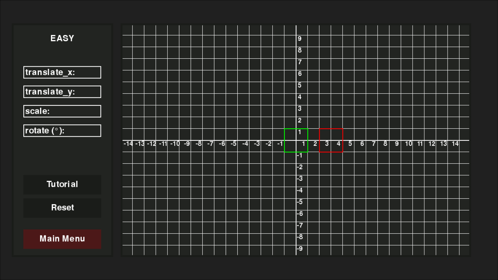

# Rectangle 2D Transformation Game
A simple pygame application to visualize 2D geometric transformations.

## Features
- **Animation Transform:** Using Translation, Rotation, and Scaling.
- **Audio Experience:** Includes background music and sound effects.

## Requirements
pygame>=2.6.1

## How to Run
1. Install Pygame:  
   `pip install pygame`
2. Run the application:  
   `python main.py`

## Project Structure
- `main.py`: Main logic and rendering.
- `assets/`: Sound effects, background music, and logo.

## Credits
Background Music: *Eclipse* by Jim Yosef (NCS).

**Developed by NiluEB Development**
